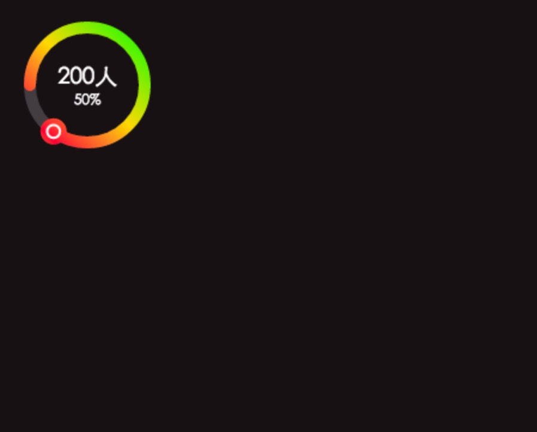

# canvas绘制圆形百分
## DEMO


## uages
```javascript
    var cc = {
        shadingColor: 'rgba(255,255,255,.25)',// 最底圆的颜色 // 渐变配置
        radius: 48,
        font: {
            fontSize: '14pt'
        },
        linearGradient: [
            { stop: 0, color: '#00ff00' },
            { stop: 0.25, color: '#fc424d' },
            { stop: 0.5, color: '#fcdd43' },
            { stop: 1, color: '#00ff00' },
        ]
    };
    draw('c', 85, ['200人', '50%'], cc);// 画布的宽高， 角度【计算圆】,
```