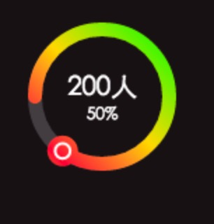
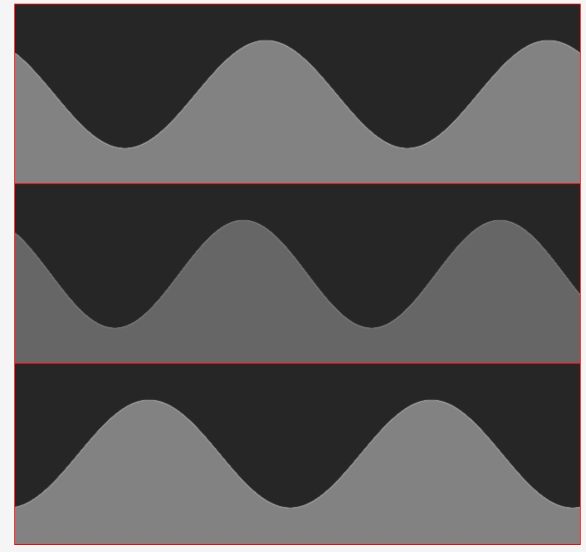

# 1.canvas绘制圆形百分 `percent-circle-canvas.js`
## DEMO


## uages
* HTML
```html
    <!DOCTYPE html>
    <html>
    <head>
        <title></title>
        <meta http-equiv="" charset="utf-8">
    </head>
    <body style="margin:0;padding:0;">
    <canvas id="c"></canvas>
    </body> 
    </html>
```
* JS 调用
```javascript
    var cc = {
        shadingColor: 'rgba(255,255,255,.25)',// 最底圆的颜色 // 渐变配置
        radius: 48,
        font: {
            fontSize: '14pt'
        },
        linearGradient: [
            { stop: 0, color: '#00ff00' },
            { stop: 0.25, color: '#fc424d' },
            { stop: 0.5, color: '#fcdd43' },
            { stop: 1, color: '#00ff00' },
        ]
    };
    draw('c', 85, ['200人', '50%'], cc);// 画布的宽高， 角度【计算圆】,
```

# 2. canvas 绘制 sin 波浪 `sin-wave.canvas.js`

## DEMO


## uages
* HTML
```html
    <!DOCTYPE html>
    <html>
    <head>
    <meta charset="utf-8">
    <meta name="viewport" content="width=device-width">
    <title>JS Bin</title>
    </head>
    <body>
    <p>Canvas sin wave</p>
    <div class="canvases">
        <canvas id = 'c'></canvas>
        <canvas id = 'c2'></canvas>
        <canvas id = 'c3'></canvas>
    </div>
    </body>
    </html>
``` 
* CSS
```
body{
  margin:0;
  overflow:hidden; 
}
canvas{
	outline:1px solid red;
	display:block;
    margin:0 auto;
  background:#333; 
}
h1, a {
  color: Cornsilk;
  font-family: serif;
  font-style: italic;
  font-size: 23px;
  text-align: center;
  font-weight: normal;
}
a{text-decoration:none;}
h1{margin: 3em 0 1em;}

.canvases{
  //background:#333;
  position:relative;
  height:250px;
}
```

